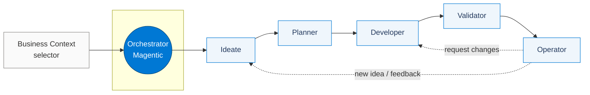
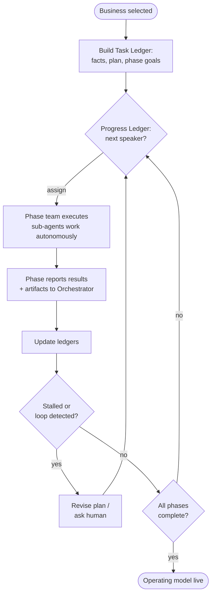

# Agentic DevOps — Product Idea Pipeline

> An interactive, multi-agent demonstration of how autonomous AI agents can drive an
> enterprise **new-product idea pipeline** end to end — from idea generation, through
> planning and development, to validation and live operations — all coordinated by a
> central orchestrator.

**Status:** Draft v0.1 · **Type:** Demo / reference application · **Audience:** Enterprise customers, field sellers, solution architects

---

## Table of Contents

1. [Vision & Overview](#1-vision--overview)
2. [Goals & Non-Goals](#2-goals--non-goals)
3. [Personas](#3-personas)
4. [Core Concept: The Agentic Product Pipeline](#4-core-concept-the-agentic-product-pipeline)
5. [Orchestration Architecture (Magentic Pattern)](#5-orchestration-architecture-magentic-pattern)
6. [Agent Specifications](#6-agent-specifications)
7. [End-to-End Flow & State Machine](#7-end-to-end-flow--state-machine)
8. [UX / UI Design](#8-ux--ui-design)
9. [Technology Stack](#9-technology-stack)
10. [Data Models](#10-data-models)
11. [Simulation vs. Live Mode](#11-simulation-vs-live-mode)
12. [Demo Script & Scenarios](#12-demo-script--scenarios)
13. [Project Structure](#13-project-structure)
14. [Implementation Roadmap](#14-implementation-roadmap)
15. [Quality: Accessibility, Performance, Security](#15-quality-accessibility-performance-security)
16. [Open Questions & Future Work](#16-open-questions--future-work)

---

## 1. Vision & Overview

**Agentic DevOps** reimagines the enterprise *new-product idea pipeline* as a fleet of
collaborating AI agents. Today, moving an idea from "someone had a thought in a meeting"
to "a shipped, monitored, growing product" crosses many disconnected teams — product,
business, engineering, QA, SRE, and go-to-market — and loses fidelity at every handoff.

This demo shows a future where that pipeline is **continuous and agent-driven**. Five
specialized multi-agent teams each own one phase of the lifecycle, and a single
**Orchestrator** keeps the big picture coherent, manages handoffs, resolves blockers,
and brings humans in at exactly the right approval gates.

The pipeline phases, in order:

| # | Phase | Agent Team | Mission |
|---|-------|-----------|---------|
| 1 | **Ideate** | Ideation team | Generate and rank new product ideas for the selected business |
| 2 | **Planner** | Planning team | Turn the best idea into a business case + DevSecOps-ready user stories |
| 3 | **Developer** | Development team | Architect, scaffold, and code the solution |
| 4 | **Validator** | Validation team | Test, validate, and prepare repo/PR pipeline (mocked) |
| 5 | **Operator** | Operations team | Deploy, observe, optimize, gather feedback, drive growth |

The **user experience is the product** in this demo. The UI must make the invisible
visible: the customer should *see* ideas being born, debated, scored, planned, built,
tested, deployed, and improved — with the orchestrator's reasoning on display the whole
time. It must feel premium, fluid, and unmistakably Microsoft.

---

## 2. Goals & Non-Goals

### Goals

- **Tell a clear story.** A non-technical executive should understand the pipeline within 30 seconds of watching it run.
- **Show multi-agent collaboration.** Each phase is itself a team of sub-agents; the orchestrator coordinates across phases.
- **Feel premium and responsive.** Single-page app, fluid motion, zero jank, Microsoft/Azure visual language (Fluent).
- **Be configurable.** Nothing runs until a **business is selected**. Users can pick the business context that frames all downstream work.
- **Surface artifacts.** Every phase produces inspectable artifacts (research briefs, scorecards, business cases, user stories, code, test reports, dashboards).
- **Human-in-the-loop.** Explicit approval gates for code review (Developer) and operational feedback (Operator).
- **Run anywhere, cheaply.** Ships with a deterministic **simulation mode** so the demo never depends on live model calls; a **live mode** can be enabled later.

### Non-Goals

- Not a production agent platform — it is a faithful, polished *demonstration*.
- Not a real CI/CD system — GitHub repo creation, check-ins, and PRs are **mocked**.
- Not a real cloud deployment — the Operator phase **simulates** deploy + observability.
- No real customer data — all businesses, ideas, and metrics are synthetic/seeded.

---

## 3. Personas

| Persona | Role | What they care about in the demo |
|---------|------|----------------------------------|
| **Executive Eva** | VP of Product | The narrative: speed from idea → market, ROI, risk reduction |
| **Architect Arjun** | Solution Architect | The orchestration pattern, agent boundaries, extensibility |
| **Engineer Erin** | Dev Lead | Code quality, DevSecOps alignment, human review gates |
| **Seller Sam** | Field Seller | A repeatable, impressive walkthrough that closes deals |

---

## 4. Core Concept: The Agentic Product Pipeline

The pipeline is a **directed flow** with one **Orchestrator** above five **phase teams**.
Work flows left-to-right, but the orchestrator can route backward (e.g., the Operator
requests changes that re-engage the Developer).



**Key principles**

- **Gated progression.** A phase cannot start until its upstream phase produces a valid, complete handoff artifact. The orchestrator enforces this.
- **Independence with coordination.** Each phase team runs its own sub-agents autonomously, then *reports in* to the orchestrator, which keeps a global ledger.
- **Every phase is potentially multi-agent.** Even "simple" phases can spawn helper agents (e.g., a market-research agent, a competitive-analysis agent).
- **Humans at the gates.** Approval checkpoints pause the flow for human decision.

---

## 5. Orchestration Architecture (Magentic Pattern)

The Orchestrator follows the **Magentic-One** style of multi-agent orchestration
(Microsoft AutoGen / Agent Framework). It maintains two ledgers and runs an outer/inner
loop:

- **Task Ledger** — facts, assumptions, the overall plan, and per-phase objectives. Built up front from the selected business + user intent; updated as facts arrive.
- **Progress Ledger** — per step: *is the task complete?*, *are we looping without progress?*, *who acts next?*, *what is the next instruction?*



**Orchestrator responsibilities**

1. Translate the selected business + intent into a concrete plan and per-phase objectives.
2. Decide which phase/agent acts next and with what instruction.
3. Validate each phase's output against its **exit criteria** before allowing progression.
4. Detect stalls/loops and either re-plan or escalate to a human.
5. Maintain a single, narratable "big picture" the UI renders live (the **Orchestrator Console**).
6. Route backward edges (Operator → Developer change requests; Operator → Ideate new ideas).

**Orchestrator outputs to the UI**

- Live reasoning stream ("thinking out loud" — concise, executive-readable).
- Current global stage + overall % complete.
- Task Ledger snapshot and Progress Ledger entries.
- Inter-agent messages (who told whom to do what).

---

## 6. Agent Specifications

Each phase team has: a **lead agent**, a set of **sub-agents**, defined **inputs**,
**outputs (artifacts)**, **exit criteria** (what the orchestrator checks), and optional
**human gates**. All scoring uses a consistent 0–100 scale with weighted rubrics so the
UI can render comparable scorecards.

### 6.0 Shared scoring rubric

| Dimension | Weight | Notes |
|-----------|--------|-------|
| Impact | 30% | Revenue/strategic upside |
| Feasibility | 20% | Technical & operational achievability |
| Cost | 15% | Inverse — lower cost scores higher |
| Risk | 15% | Inverse — lower risk scores higher |
| Strategic fit | 10% | Alignment to selected business |
| Time-to-market | 10% | Speed to realize value |

`overallScore = Σ(dimensionScore × weight)`

---

### 6.1 Ideate Agent (Ideation Team)

**Mission:** Generate and rank new product/feature ideas for the **selected business**.

**Precondition:** A business **must** be selected. No business → phase is disabled with a clear prompt.

**Sub-agents**

| Sub-agent | Job |
|-----------|-----|
| Trend & Market Research agent | Analyze trends, headwinds/tailwinds, adjacent-industry ideas; theorize products not yet on the market |
| Idea Generation agent | Produce a broad set of candidate ideas grounded in the research |
| Cost–Benefit agent | Estimate cost vs. benefit for each candidate |
| Risk Analysis agent | Assess risk of each candidate to the business |
| Competitive Analysis agent | Map competitors, positioning, differentiation, white space |
| Synthesis & Ranking agent | Merge signals, apply rubric, rank |

**Inputs:** Selected business profile (industry, size, current products, strategic goals), optional user steer/theme.

**Outputs (artifacts)**

- `MarketResearchBrief` — trends, headwinds, opportunities, "blue-sky" concepts.
- `CompetitiveLandscape` — competitor matrix + identified white space.
- `IdeaScorecard[]` — for each idea: cost-benefit, risk, competitive notes, dimension scores, **overall score**, justification, **impact score**.
- `TopIdeas` — the **top 5** ideas with scores, justification, and impact.

**Exit criteria:** ≥5 scored ideas; each has justification + impact; top-5 ranked.

---

### 6.2 Planner Agent (Planning Team)

**Mission:** Turn the best idea(s) into a fundable plan and **DevSecOps-ready** work items.

**Sub-agents**

| Sub-agent | Job |
|-----------|-----|
| Idea Review agent | Ingest Ideate's top-5, validate assumptions |
| Business Case agent | Build the business case (problem, solution, market, ROI, costs) |
| Competitive Strategy agent | Analyze compete data → recommend next steps/positioning |
| Triage agent | Select the **single** top idea to advance |
| Story & Docs agent | Author user story, acceptance criteria, NFRs, security/compliance notes per Microsoft DevSecOps best practices |

**Inputs:** `TopIdeas` + scorecards from Ideate; selected business profile.

**Outputs (artifacts)**

- `BusinessCase` — problem, proposed solution, target market, ROI model, cost, timeline, risks.
- `CompetitiveStrategy` — recommended next steps vs. competitors.
- `TriageDecision` — the chosen idea + rationale for not choosing the others.
- `UserStory` + `AcceptanceCriteria[]` + `NonFunctionalRequirements` + `SecurityComplianceNotes` (DevSecOps).
- `DefinitionOfReady` checklist (all green before handoff).

**Exit criteria:** Exactly one idea advanced; user story + acceptance criteria + NFRs + security notes complete; Definition of Ready satisfied — *the Developer can proceed without further guidance*.

---

### 6.3 Developer Agent (Development Team)

**Mission:** Produce working code that fulfills the planned story, aligned to Microsoft best practices.

**Sub-agents**

| Sub-agent | Job |
|-----------|-----|
| Planning agent | Break the story into a technical task plan |
| Architecture agent | Define architecture; validate against Microsoft/Azure best practices (Well-Architected) |
| Scaffolding agent | Lay out project structure / framework / boilerplate |
| Coder agent | Implement the tasks, assemble components |

**Human-in-the-loop gate:** **Code Review** — a human must approve (or request changes) before the Validator phase. UI presents a diff-style review with the architecture rationale and a checklist.

**Inputs:** `UserStory`, acceptance criteria, NFRs, security notes from Planner.

**Outputs (artifacts)**

- `TechnicalPlan` — task breakdown, sequencing, dependencies.
- `ArchitectureDecisionRecord` (ADR) — components, data flow, Azure services, best-practice alignment.
- `ScaffoldManifest` — files/folders/framework chosen.
- `CodeChangeSet` — generated code (rendered with syntax highlighting; demo uses representative snippets/files).
- `CodeReviewPacket` — summary, risk callouts, checklist for the human reviewer.

**Exit criteria:** Code change set complete; architecture validated; **human code review approved**.

---

### 6.4 Validator Agent (Validation Team)

**Mission:** Test and validate the developer's output; prepare the GitHub pipeline (**mocked**).

**Sub-agents**

| Sub-agent | Job |
|-----------|-----|
| Unit Test agent | Generate + run unit tests |
| Smoke/Integration agent | Smoke tests, basic integration checks |
| Security/Quality agent | SAST/dependency/quality gates (industry-standard protections) |
| Source Control agent (**mocked**) | Create repo if needed, commit/check-in, open pull request |

**Inputs:** `CodeChangeSet` + acceptance criteria + NFRs.

**Outputs (artifacts)**

- `TestReport` — unit/smoke/integration results, coverage, pass/fail per acceptance criterion.
- `QualityGateReport` — security/quality findings + status.
- `MockPullRequest` — simulated repo, branch, commits, PR with checks (clearly labeled *mock*).

**Exit criteria:** All required tests green (or waivers logged); quality gates pass; mock PR opened and "checks passing."

---

### 6.5 Operator Agent (Operations Team)

**Mission:** Deploy, observe, optimize, and grow the shipped idea; close the feedback loop.

**Sub-agents**

| Sub-agent | Job |
|-----------|-----|
| Deployment agent | Simulate deployment after validation |
| Observability agent | Emit synthetic telemetry/SLOs; health, latency, errors, usage |
| Optimization agent | Analyze telemetry → recommend optimizations; can **request changes** from Developer |
| Feedback agent | Incorporate human-in-the-loop operator feedback + simulated user feedback |
| Go-to-Market agent | Produce launch/positioning/growth plan for the new product/feature |

**Human-in-the-loop gate:** **Operations Feedback** — operators can approve optimizations, file change requests, or accept the GTM plan.

**Inputs:** `MockPullRequest` / validated build; business profile; original business case.

**Outputs (artifacts)**

- `DeploymentRecord` — environment, version, status (simulated).
- `ObservabilityDashboard` — live-updating synthetic metrics + SLOs.
- `OptimizationReport` — findings + recommended changes (may spawn a backward edge to Developer).
- `GoToMarketPlan` — launch plan, segments, messaging, growth levers, KPIs.
- `FeedbackLog` — human + simulated user feedback, dispositioned.

**Exit criteria:** Deployment "healthy"; GTM plan delivered; feedback loop active. Backward edges (change requests / new ideas) routed through the Orchestrator.

---

## 7. End-to-End Flow & State Machine

Each phase moves through a small state machine; the orchestrator advances phases.

```
idle → waiting_for_input → running → needs_human (optional) → complete
                                   ↘ blocked ↗
```

- **idle** — not yet reached (and, for Ideate, no business selected).
- **waiting_for_input** — upstream artifact required but not present.
- **running** — sub-agents are working (UI streams activity).
- **needs_human** — paused at an approval gate (Developer review, Operator feedback).
- **blocked** — exit criteria failed; orchestrator re-plans or escalates.
- **complete** — artifacts produced and validated; handoff emitted.

**Global pipeline status** = aggregate of phase states + overall % complete, shown in the top progress rail.

---

## 8. UX / UI Design

> **The UX is the headline.** It must be highly professional, fluid, responsive, and feel
> like a first-party Microsoft experience. Build it with the **Claude professional UI
> skill** (web-artifacts-builder) and **Fluent UI** so the result is premium by default.

### 8.1 Design language

- **Fluent / Microsoft + Azure** visual identity.
- **Color:** Azure blue primary `#0078D4` (hover `#106EBE`, pressed `#005A9E`, dark `#004578`), light neutral surfaces (`#FAF9F8`, `#F3F2F1`, `#EDEBE9`), ink `#323130`/`#201F1E`, with Microsoft accent palette for state:
  - success `#107C10`, warning `#FFB900`, error `#D13438`, info `#0078D4`.
- **Type:** Segoe UI / Segoe UI Variable stack. Clear hierarchy, generous spacing.
- **Surfaces:** Subtle depth (Fluent elevation/acrylic), rounded `8px` cards, soft shadows.
- **Motion:** Purposeful, fast (120–240ms), eased; streaming text, animated progress, agent "pulse" while working, smooth lane expansion. Never janky. Respect `prefers-reduced-motion`.

### 8.2 Layout

```
┌─────────────────────────────────────────────────────────────────────────────┐
│  HEADER:  ◆ Agentic DevOps     [ Business: ▼ Contoso Retail ]   ▶ Run  ⚙︎ Mode │
├─────────────────────────────────────────────────────────────────────────────┤
│  GLOBAL PROGRESS RAIL:  ①Ideate ─ ②Planner ─ ③Developer ─ ④Validator ─ ⑤Operator│
│                         ●━━━━━━━●━━━━━━━○──────○──────○      overall 42%        │
├───────────┬───────────┬───────────┬───────────┬───────────────────────────────┤
│  IDEATE   │  PLANNER  │ DEVELOPER │ VALIDATOR │  OPERATOR                       │
│  (lane)   │  (lane)   │  (lane)   │  (lane)   │  (lane)                         │
│           │           │           │           │                                 │
│ sub-agents│ sub-agents│ sub-agents│ sub-agents│ sub-agents                      │
│ activity  │ activity  │ activity  │ activity  │ activity                        │
│ artifacts │ artifacts │ artifacts │ artifacts │ artifacts                       │
│ status    │ status    │ status    │ status    │ status                          │
├───────────┴───────────┴───────────┴───────────┴───────────────────────────────┤
│  ORCHESTRATOR CONSOLE (collapsible):  reasoning stream · task & progress ledger │
└─────────────────────────────────────────────────────────────────────────────┘
```

- **Header** — brand, **business selector** (gates everything), Run/Pause, Sim/Live mode toggle, settings.
- **Global Progress Rail** — a horizontal stepper showing the **overall place in the pipeline**, each node's state (done/active/pending/needs-human/blocked) and overall %.
- **Five vertical lanes** — Ideate, Planner, Developer, Validator, Operator, **in this order**. Each lane is a column showing:
  - Lane header: name, icon, status pill, mini-progress.
  - **Sub-agent roster** with live status (idle/working/done) and a working "pulse."
  - **Activity stream** — concise, streaming log of what the team is doing.
  - **Artifacts** — cards that open a detail drawer/modal (scorecards, briefs, business case, user story, code, test report, dashboard, GTM plan).
  - **Human gate** affordance when `needs_human` (Approve / Request changes).
- **Orchestrator Console** — a collapsible bottom panel (or right rail) streaming the orchestrator's reasoning and rendering the Task/Progress ledgers and inter-agent messages.

### 8.3 Key interactions & states

- **Empty / no business** → lanes are dimmed; a friendly call-to-action: *"Select a business to begin."* Run is disabled.
- **Run** → orchestrator builds the plan; Ideate activates; subsequent lanes activate as handoffs complete.
- **Active lane** → highlighted, sub-agents pulse, activity streams, progress fills.
- **Artifact open** → side **drawer** or modal with rich, scrollable content; scorecards show bar/radar visualizations.
- **Human gate** → lane shows a banner; clicking opens the review (diff for code, summary for ops) with Approve / Request changes.
- **Backward edge** → when Operator requests changes, animate a connector back to Developer and re-activate it.
- **Responsive** → lanes are horizontally scrollable on narrow viewports; on wide screens all five fit. Console docks/undocks.

### 8.4 Component inventory (build list)

- `AppShell`, `Header`, `BusinessSelector`, `ModeToggle`, `RunControls`
- `PipelineRail` (global stepper) + `PipelineNode`
- `PhaseLane` + `LaneHeader`, `SubAgentList`, `SubAgentChip`, `ActivityStream`, `ArtifactGrid`, `ArtifactCard`
- `HumanGateBanner`, `CodeReviewDrawer`, `OpsFeedbackDrawer`
- `OrchestratorConsole` + `ReasoningStream`, `TaskLedgerView`, `ProgressLedgerView`, `AgentMessageList`
- `ArtifactDrawer` (polymorphic by artifact type) with renderers: `ScorecardView`, `MarketBriefView`, `CompetitiveMatrix`, `BusinessCaseView`, `UserStoryView`, `CodeView`, `TestReportView`, `Dashboard`, `GtmPlanView`
- Primitives: `StatusPill`, `ScoreBar`, `RadarChart`, `MetricTile`, `Pulse`, `Timeline`

---

## 9. Technology Stack

| Layer | Choice | Why |
|-------|--------|-----|
| Framework | **React 18 + TypeScript** | SPA, component model, type safety |
| Build/dev | **Vite** | Fast HMR, lean builds |
| UI kit | **Fluent UI v9** (`@fluentui/react-components`) | First-party Microsoft look & theming |
| Icons | `@fluentui/react-icons` | Consistent Fluent iconography |
| Motion | **Framer Motion** | Fluid, controllable animation; reduced-motion aware |
| State | **Zustand** | Minimal, ergonomic global store for pipeline state |
| Charts | **Recharts** (or lightweight custom SVG) | Scorecards, radar, dashboards |
| Routing | Single view (optional **React Router** for deep links to artifacts) | SPA |
| Engine | **Simulation engine** (TypeScript) | Deterministic, scripted multi-agent runs; no backend needed |
| Live mode (later) | Azure OpenAI / Azure AI Agent Service / Semantic Kernel or AutoGen | Swap simulated agents for real ones |
| Lint/format | ESLint + Prettier | Quality |
| Test | Vitest + React Testing Library | Component/unit tests |

**Why simulation-first:** the demo must be reliable, fast, and offline-capable. The agent
runtime is abstracted behind an `AgentRunner` interface so a **SimulatedRunner** (scripted,
timed, streaming) ships now and a **LiveRunner** (real model calls) can be added without UI
changes.

---

## 10. Data Models

Representative TypeScript types (the simulation and UI share these contracts):

```ts
type PhaseId = 'ideate' | 'planner' | 'developer' | 'validator' | 'operator';
type PhaseStatus =
  | 'idle' | 'waiting_for_input' | 'running'
  | 'needs_human' | 'blocked' | 'complete';

interface BusinessProfile {
  id: string;
  name: string;
  industry: string;
  size: 'startup' | 'midmarket' | 'enterprise';
  currentProducts: string[];
  strategicGoals: string[];
  description: string;
}

interface SubAgent {
  id: string;
  name: string;
  role: string;
  status: 'idle' | 'working' | 'done' | 'error';
}

interface ScoreBreakdown {
  impact: number; feasibility: number; cost: number;
  risk: number; strategicFit: number; timeToMarket: number;
  overall: number; // weighted
}

interface Idea {
  id: string;
  title: string;
  summary: string;
  scores: ScoreBreakdown;
  impactScore: number;
  justification: string;
  costBenefit: string;
  riskNotes: string;
  competitiveNotes: string;
}

interface Artifact {
  id: string;
  phase: PhaseId;
  type: ArtifactType; // 'market_brief' | 'competitive' | 'scorecard' | 'business_case'
                      // | 'user_story' | 'adr' | 'code' | 'test_report'
                      // | 'mock_pr' | 'dashboard' | 'gtm_plan' | ...
  title: string;
  createdAt: string;
  data: unknown; // narrowed per type by the renderer
}

interface HumanGate {
  phase: PhaseId;
  kind: 'code_review' | 'ops_feedback';
  status: 'pending' | 'approved' | 'changes_requested';
  note?: string;
}

interface PhaseState {
  id: PhaseId;
  status: PhaseStatus;
  progress: number;        // 0..100
  subAgents: SubAgent[];
  activity: ActivityEvent[];
  artifacts: Artifact[];
  gate?: HumanGate;
}

interface OrchestratorState {
  reasoning: ReasoningEvent[];   // streamed "thinking"
  taskLedger: { facts: string[]; plan: string[]; phaseGoals: Record<PhaseId, string> };
  progressLedger: ProgressEntry[];
  messages: AgentMessage[];      // who instructed whom
  overallProgress: number;       // 0..100
  currentPhase: PhaseId | null;
}

interface PipelineState {
  business: BusinessProfile | null;
  mode: 'simulation' | 'live';
  running: boolean;
  phases: Record<PhaseId, PhaseState>;
  orchestrator: OrchestratorState;
}
```

`AgentRunner` abstraction:

```ts
interface AgentRunner {
  start(business: BusinessProfile): void;
  pause(): void;
  resume(): void;
  resolveGate(phase: PhaseId, decision: 'approve' | 'request_changes', note?: string): void;
  subscribe(onEvent: (e: PipelineEvent) => void): () => void; // streamed updates
}
// SimulatedRunner implements this now; LiveRunner later.
```

---

## 11. Simulation vs. Live Mode

- **Simulation mode (default).** A scripted engine drives each phase: it advances sub-agent
  statuses, streams activity + orchestrator reasoning on realistic timers, and emits seeded
  artifacts (ideas, scorecards, business case, code, test report, dashboard, GTM plan). It is
  **deterministic per business** so demos are repeatable, and supports pause/resume and human gates.
- **Live mode (future).** Same UI and event contracts, but a `LiveRunner` calls real models
  (Azure OpenAI / Agent Service / Semantic Kernel / AutoGen) and real-but-mocked tools. The
  Validator's GitHub actions and the Operator's deploy/telemetry remain **mocked** even in live mode.

A **Mode toggle** in the header switches runners. Seed data lives in `src/data/` (businesses,
scripted runs, artifact fixtures).

---

## 12. Demo Script & Scenarios

**Seeded businesses** (examples): *Contoso Retail* (omnichannel retail), *Fabrikam
Financial* (fintech), *Northwind Logistics* (supply chain). Each has a tailored scripted run.

**Golden-path walkthrough (≈3–4 min):**

1. Presenter selects **Contoso Retail**. Lanes light up; Run enables.
2. **Run.** Orchestrator streams its plan; **Ideate** activates — research → ideas → cost/benefit → risk → compete → **Top 5** scorecard appears.
3. **Planner** ingests top-5 → business case → triage to **one** idea → **user story** + acceptance/NFR/security.
4. **Developer** plans → ADR → scaffold → code. **Human gate:** presenter approves the **code review**.
5. **Validator** runs unit/smoke tests + quality gates → opens a **mock PR** with passing checks.
6. **Operator** "deploys" → live **dashboard** updates → **optimization** finding → **GTM plan**. Presenter approves ops feedback.
7. Optional flourish: Operator files a **change request** → connector animates back to **Developer**, showing the closed loop.

---

## 13. Project Structure

```
AgenticDevOps/
├─ SPEC.md                      # this document
├─ README.md                    # quickstart (added in build phase)
├─ index.html
├─ package.json
├─ vite.config.ts
├─ tsconfig.json
└─ src/
   ├─ main.tsx
   ├─ App.tsx
   ├─ theme/                    # Fluent theme tokens (Azure palette), global styles
   ├─ store/                    # Zustand pipeline store
   ├─ engine/
   │  ├─ AgentRunner.ts         # interface
   │  ├─ SimulatedRunner.ts     # scripted engine
   │  └─ scripts/               # per-business scripted runs
   ├─ data/                     # seeded businesses + artifact fixtures
   ├─ types/                    # shared TS contracts (section 10)
   ├─ components/
   │  ├─ shell/                 # AppShell, Header, RunControls, BusinessSelector, ModeToggle
   │  ├─ pipeline/              # PipelineRail, PipelineNode
   │  ├─ lane/                  # PhaseLane + sub-components
   │  ├─ orchestrator/          # OrchestratorConsole + ledgers + reasoning
   │  ├─ artifacts/             # ArtifactDrawer + per-type renderers
   │  └─ primitives/            # StatusPill, ScoreBar, RadarChart, MetricTile, Pulse, Timeline
   └─ utils/
```

---

## 14. Implementation Roadmap

| Phase | Deliverable | Highlights |
|-------|-------------|-----------|
| **0. Spec** ✅ | This document | Shared understanding & contracts |
| **1. Scaffold** | Vite + React + TS + Fluent + theme | Azure theme tokens, AppShell, empty lanes, business selector gating |
| **2. State & engine** | Zustand store + `AgentRunner` + `SimulatedRunner` skeleton | Event streaming, phase state machine, pause/resume |
| **3. Pipeline & lanes UI** | Global rail + 5 lanes + sub-agent rosters + activity streams | Motion, status, progress |
| **4. Orchestrator console** | Reasoning stream + Task/Progress ledgers + messages | Magentic narration |
| **5. Artifacts** | Drawer + renderers (scorecard, brief, business case, user story, code, test report, dashboard, GTM) | Charts/visuals |
| **6. Human gates** | Code review + ops feedback drawers | Approve / request changes; backward edge |
| **7. Seed content** | 3 businesses + scripted golden-path runs | Repeatable demos |
| **8. Polish** | Motion tuning, responsive, a11y, reduced-motion, perf | Premium feel |
| **9. (Optional) Live mode** | `LiveRunner` w/ Azure OpenAI / Agent Service | Swappable, UI unchanged |

---

## 15. Quality: Accessibility, Performance, Security

- **Accessibility:** WCAG 2.1 AA. Keyboard-navigable lanes/drawers, focus management, ARIA roles/live-regions for streaming activity, AA color contrast, `prefers-reduced-motion`.
- **Performance:** 60fps animations, virtualized long streams, lazy-loaded artifact renderers, memoized selectors; cold load < 2s on broadband.
- **Security/privacy:** No secrets in the repo; synthetic data only; live-mode keys via env vars (never committed); all GitHub/deploy actions clearly labeled **mock**.

---

## 16. Open Questions & Future Work

1. **Depth of "code" artifact** — representative snippets vs. a small real generated app? (Default: representative, multi-file snippets.)
2. **Live-mode framework** — Semantic Kernel vs. AutoGen/Agent Framework for the real orchestrator? (Default: AutoGen/Agent Framework to mirror Magentic.)
3. **Persistence** — should runs be saved/shareable (deep links, export to PDF)? (Future.)
4. **Multiple concurrent ideas** — pipeline currently advances one idea; support a portfolio view later.
5. **Telemetry realism** — depth of the synthetic observability model in Operator.

---

*End of spec — ready to scaffold (Roadmap Phase 1).*
